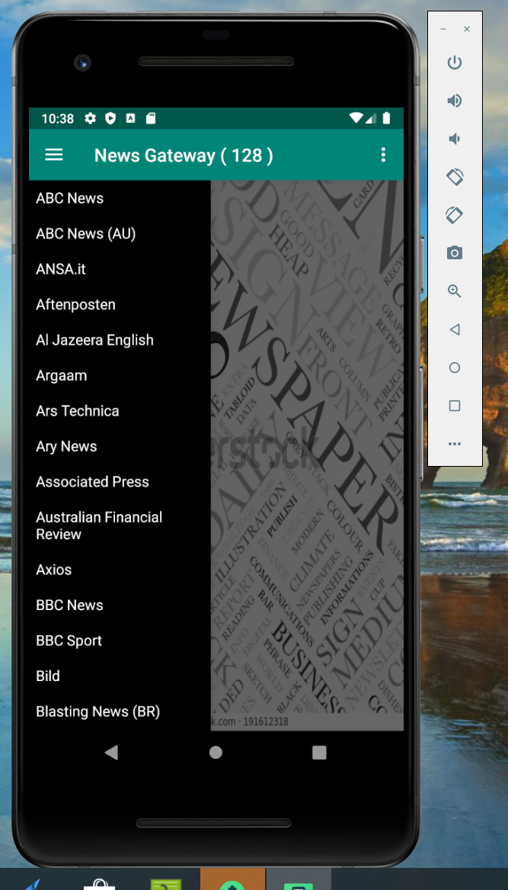
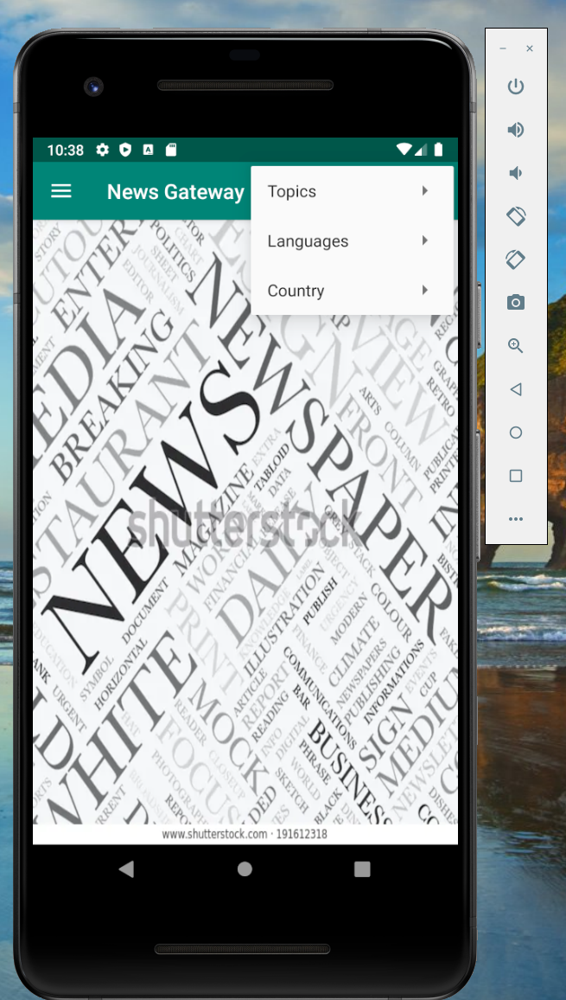
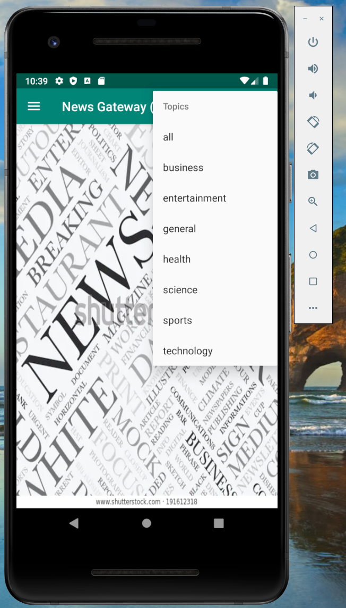
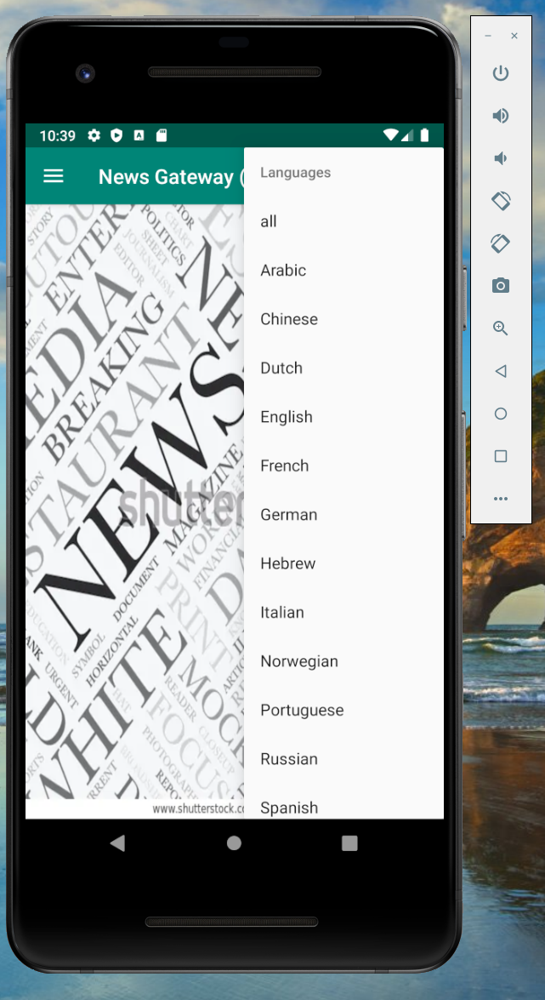
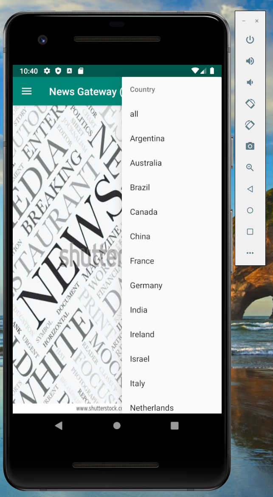
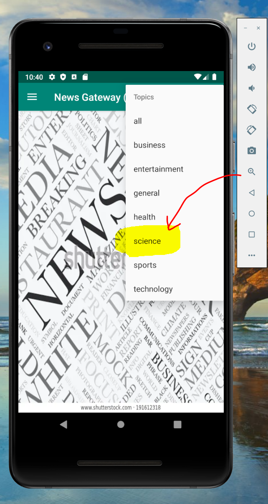
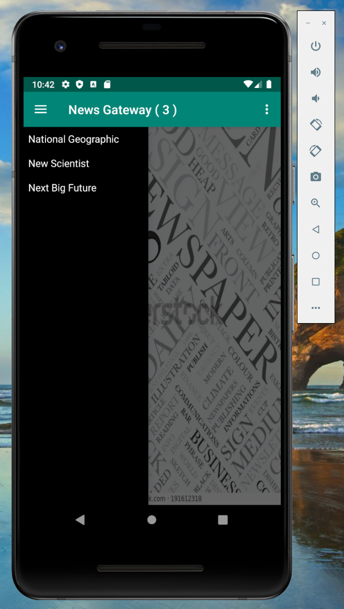
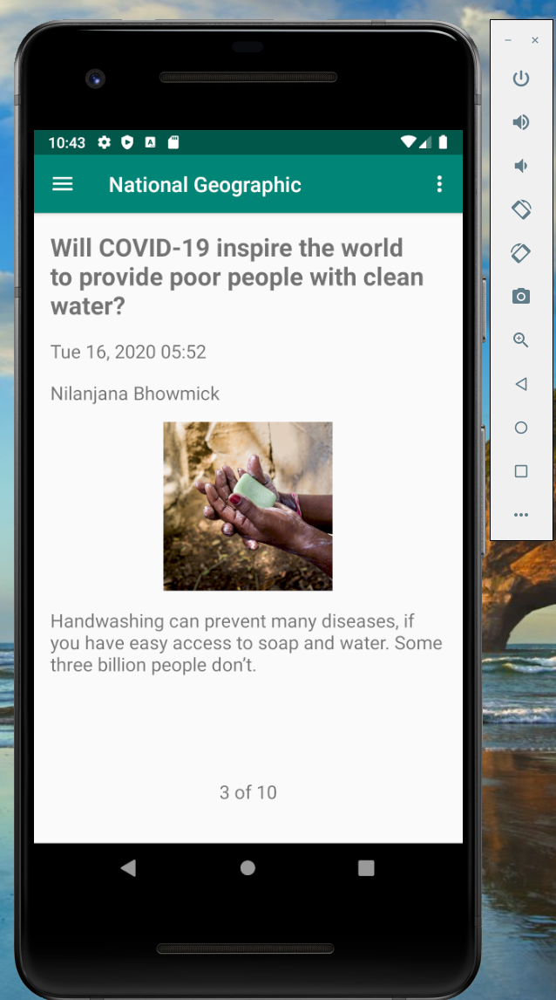
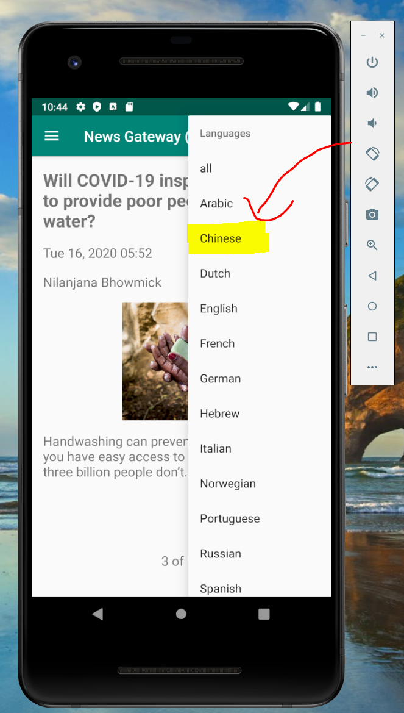
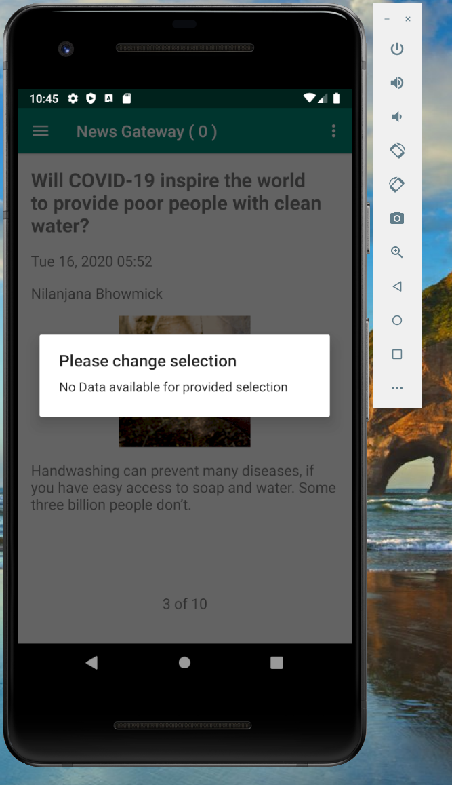

  :newspaper: 

* This app displays current news articles from a wide variety of news sources covering a range of news categories.
* NewsAPI.org will be used to acquire the news sources and news articles.
* Selecting a news source (i.e., CNN, Time, etc.) will display up to 10 top stories from that news source.
* Selecting a topic will limit the news source choices to only those offering that topic of news.
* Selecting a country will limit the news source choices to those from the selected country.
* Selecting a language will limit the news source choices to only those offering news in the selected language.
* News articles are viewed by swiping right to read the next article, and left to go back to the previous article
* The user can go to the complete extended article on the news source’s website by clicking on the article title, text, or image content.
* Launcher icon for an app.

**Screenshots**

1.  Drawer Layout in App :       
2.  Menu list in App :       
3.  Sub menu in Topics:       
4.  Sub menu in Languages:       
5.  Sub menu in Country:       
6.  Selecting "Science" as a topic:       
7.  Counting Updated:       
8.  Refreshed Drawer Layout according to the selection:       
9.  Opening any news source from the Drawer layout:       
10. Selecting "Chinese" as a Language:       
11. No match found based on selected values from the Dynamic sub menu, So providing user message in alert box:       
